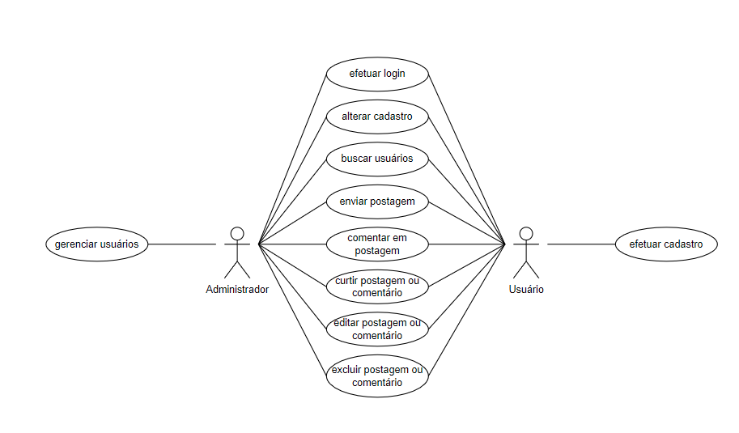

# Documento de Casos de Uso

  ## Lista dos Casos de Uso

 - [CDU 01](#CDU-01): Efetuar Login
 - [CDU 02](#CDU-02): Cadastro de usuários 
 - [CDU 03](#CDU-03): Efetuar Logout
 - [CDU 04](#CDU-04): Alterar cadastro
 - [CDU 05](#CDU-05): Listar usuários
 - [CDU 06](#CDU-06): Editar usuários
 - [CDU 07](#CDU-07): Buscar usuários 
 - [CDU 08](#CDU-08): Excluir Usuário 
 - [CDU 09](#CDU-09): Conceder Privilégios de Admnistrador
 - [CDU 10](#CDU-10): Retirar Privilégios de Admnistrador 
 - [CDU 11](#CDU-11): Criar Postagem
 - [CDU 12](#CDU-12): Editar Postagem
 - [CDU 13](#CDU-13): Excluir Postagem
 - [CDU 14](#CDU-14): Exibir Timeline
 - [CDU 15](#CDU-15): Excluir Postagem como administrador
 - [CDU 16](#CDU-16): Criar Comentário
 - [CDU 17](#CDU-17): Editar Comentário
 - [CDU 18](#CDU-18): Excluir Comentário
 - [CDU 19](#CDU-19): Exibir Comentário Na Timeline
 - [CDU 20](#CDU-20): Curtir Postagem
 - [CDU 21](#CDU-21): Curtir Comentário
 - [CDU 22](#CDU-22): Remover Curtida de Postagem
 - [CDU 23](#CDU-23): Remover Curtida de Comentário 
 - [CDU 24](#CDU-24): Excluir Comentário como admnistrador

  ## Lista dos Atores

  - Administrador
  - Usuário

  ## Diagrama de Casos de Uso

  ## Descrição dos Casos de Uso

  ### CDU 01
  
  Efetuar login 

  **Fluxo Principal**

  1. O sistema apresenta um formulario com os campos "Username" e "Senha".
  2. O usuário preenche os campos e clica no botão "Enviar".
  3. O sistema valida as informações do usuário.
  4. O sistema encaminha o usuário para a home.
  5. Ao logar é feita uma autenticação do usuário para saber se o usuário é moderador.

  ### CDU 02

  Cadastro de usuários 

  1. O sistema apresenta um formulário com os campos Username;Email;Senha;Confirmar Senha;.
  2. O usuário preenche todos os campos e clica no botão "Cadastrar".
  3. O sistema valida as informações do usuário.
  4. O sistema encaminha o usuário para a próxima tela, na qual informa que os dados foram digitados corretamente e o usuário foi cadastrado e com o botão de voltar    para o login.

  ### CDU 03

  Efetuar Logout

  **Fluxo Principal**

  1. O usuário clica no botão "Logout" na barra de navegação.
  2. O usuário é redirecionado para a página de login.
 
 ### CDU 04

Alterar cadastro

**Fluxo Principal**

1. O usuário na página "Home" clica em "Alterar Conta" e é redirecionado a página de alteração de usuário.
2. O sistema apresenta um formulário com os campos Username; Senha atual; Senha nova; Repita a senha nova; E-mail;.
3. O sistema válida as informações do usuário.
4. O usuário é redirecionado para a "Home".

### CDU 05

Listar usuários

**Fluxo Principal**

1. Caso o usuário seja administrador, dentro da página "Home", irá aparecer o seguinte botão na barra de navegação "Administração"
2. O moderador clica em "Mostrar usuários".
3. O sistema redireciona o moderador para a página que exibe os usuários cadastrados.
4. O moderador tem acesso aos perfis de usuários com o botão "Editar usuário" para cada respectivo usuário.
5. O moderador tem acesso aos perfis de usuários com o botão "Deletar usuário" para cada respectivo usuário.
6. O moderador tem acesso aos perfis de usuários com o botão "Promover para administrador" para cada respectivo usuário.
7. O moderador tem acesso aos perfis de usuários com o botão "Retirar administrador" para cada respectivo usuário.

### CDU 06

Editar usuários 

**Fluxo Principal**

1. O moderador clica em "Exibir usuários"
2. O sistema redireciona o moderador para a página que exibe os usuários cadastrados.
3. O moderador tem acesso aos perfis de usuários com os botões "Editar usuário" para cada respectivo usuário.
4. O moderador clica em "Editar usuário" no perfil do usuário desejado.
7. O sistema redireciona o moderador para a próxima página com os campos "Username", "Email", "Senha", "Nova Senha" e o botão "Enviar".
8. O moderador clica no botão "Enviar".
9. O sistema encaminha o moderador para a próxima tela, na qual informa que os dados foram digitados corretamente e foram alterados com sucesso,apresentando o botão "Início".

### CDU 07

Buscar usuários 

**Fluxo Principal**

1. O usuário clica no barra de pesquisa de usuário.
2. O sistema abre a página de pesquisa de usuários.
3. O usuário digita o username desejado e aperta o botão "Buscar".
4. O sistema exibe o usuário cadastrados com o respectivo username e o botão "Ver Perfil".

### CDU 08

Excluir Usuário 

**Fluxo Principal**

1. O moderador clica em "Exibir Usuários".
2. O sistema abre a página contendo todos os usuários cadastrados .
3. O moderador tem acesso aos perfis de usuários com o botão "Deletar usuário" para cada respectivo usuário.
4. O sistema redireciona o moderador para a página seguinte, na qual informa que o usuário foi excluído com sucesso e apresenta os botões "Início".

### CDU 09

Promover Privilégios de Admnistrador 

**Fluxo Principal**

1. O moderador clica em "Exibir Usuários"
2. O sistema abre a página contendo todos os usuários cadastrados 
3. O moderador tem acesso aos perfis de usuários com o botão "Promover para administrador" para cada respectivo usuário.

### CDU 10

Retirar Privilégios de Admnistrador

**Fluxo Principal**

1. O moderador clica em "Exibir Usuários"
2. O sistema abre a página contendo todos os usuários cadastrados 
3. O moderador tem acesso aos perfis de usuários com o botão "Retirar administrador" para cada respectivo usuário.

### CDU 11

Criar Postagem

**Fluxo Principal**

1. Dentro da página "Home" o usuário escreve sua postagem.
2. O usuário clica no botão "Publicar".
3. O usuário permanece na página "Home".

### CDU 12

Editar Postagem

**Fluxo Principal**

1. O usuário clica em "Mostrar postagens" dentro da página "Home".
2. O sistema abre uma página com todas suas postagens.
3. Embaixo de cada postagem existe o botão alterar postagem.
4. O usuário edita os campos e clica no botão "Enviar"

### CDU 13

Excluir Postagem

**Fluxo Principal**

1. O usuário clica em "Mostrar postagens" dentro da página "Home".
2. O sistema abre uma página com todas suas postagens.
3. Embaixo de cada postagem existe o botão excluir postagem.
4. O sistema abre uma caixa de dialogo com a pergunta "Tem certeza de que deseja excluir a postagem?" com os botões "Ok" e "Cancelar".
5. O usuário edita os campos e clica no botão "Enviar".

### CDU 14

Exibir Timeline

**Fluxo Principal**

1. O usuário clica em "Mostrar postagens" dentro da página "Home".
2. O sistema abre uma página com todas suas postagens.

### CDU 15

Excluir Postagem como admnistrador

**Fluxo Principal**

1. O moderador clica na barra de pesquisa, onde pesquisa a conta de usuário.
2. O sistema mostra o resultado da pesquisa com botão de "mostrar postagens" para cada usuário.
3. O sistema mostra as postagens do usuário selecionado com o botão "Excluir postagem".

### CDU 16

Criar Comentário

**Fluxo Principal**

1. O usuário navega para a postagem desejada.
2. O sistema apresenta a postagem,exibindo a quantidade de curtidas da postagem, os comentários feitos e a opção "Comente aqui..." com um botão "Publicar"
3. O usuário digita o que deseja e clica no botão "Publicar"
4. O sistema valida o comentário do usuário e recarrega a página atualizando para exibir o mesmo.

### CDU 17

Editar Comentário

**Fluxo Principal**

1. O usuário abre a postagem desejada.
2. O sistema mostra um botão de abrir comentários.
3. O sistema mostra todos os comentários.
4. O usuário vai no comentário que deseja editar e clica em "Editar" ao lado do mesmo.
5. O sistema abre o comentário feito anteriormente para que o usuário possa editá-lo.
6. O usuário edita o comentário e clica em "Enviar"
7. O sistema valida o comentário do usuário e recarrega a página atualizando para exibir o mesmo.

### CDU 18

Excluir Comentário

**Fluxo Principal**

1. O usuário navega para a postagem desejada.
2. O sistema mostra um botão de abrir comentários.
3. O sistema mostra todos os comentários.
4. O usuário vai no comentário que deseja editar e clica em "Excluir" ao lado do mesmo.
5. O usuário clica em "Excluir"
6. O sistema abre uma caixa de diálogo perguntando se o usuário deseja mesmo excluir o comentário com os botões "OK" e "Cancelar"
7. O usuário clica em "OK"
8. O sistema exclui o comentário.

### CDU 19

Exibir Comentário na Timeline

**Fluxo Principal**

1. O usuário navega para a postagem desejada.
2. O sistema mostra um botão de abrir comentários.
3. O sistema mostra todos os comentários.

### CDU 20

Curtir Postagem

**Fluxo Principal**

1. O usuário navega para a postagem desejada.
2. O sistema mostra o botão "Curtir".
3. O usuário clica no botão "Curtir".

### CDU 21

Curtir Comentário

**Fluxo Principal**

1. O usuário navega para a postagem desejada.
2. O sistema mostra um botão de abrir comentários.
3. O sistema mostra todos os comentários.
4. O sistema mostra o botão "Curtir".
5. O usuário clica no botão "Curtir".

### CDU 22

Remover Curtirda de Postagem

**Fluxo Principal**

1. O usuário navega para a postagem desejada.
2. O sistema mostra o botão "Descurtir" caso o usuário já tenha curtido.
3. O usuário clica no botão "Descurtir".

### CDU 23

Remover Curtirda de Comentário

**Fluxo Principal**
1. O usuário navega para a postagem desejada.
2. O sistema mostra um botão de abrir comentários.
3. O sistema mostra todos os comentários.
2. O sistema mostra o botão "Descurtir" caso o usuário já tenha curtido.
3. O usuário clica no botão "Descurtir".

### CDU 24

Excluir Comentário como administrador

**Fluxo Principal**

1. O admnistrador navega para a postagem desejada.
2. O sistema mostra um botão de abrir comentários.
3. O sistema mostra todos os comentários.
4. O sistema mostra os comentários com um botão "excluir" ao lado.
5. O usuário clica em "Excluir"
6. O sistema abre uma caixa de diálogo perguntando se o usuário deseja mesmo excluir o comentário com os botões "OK" e "Cancelar"
7. O usuário clica em "OK"
8. O sistema exclui o comentário.
