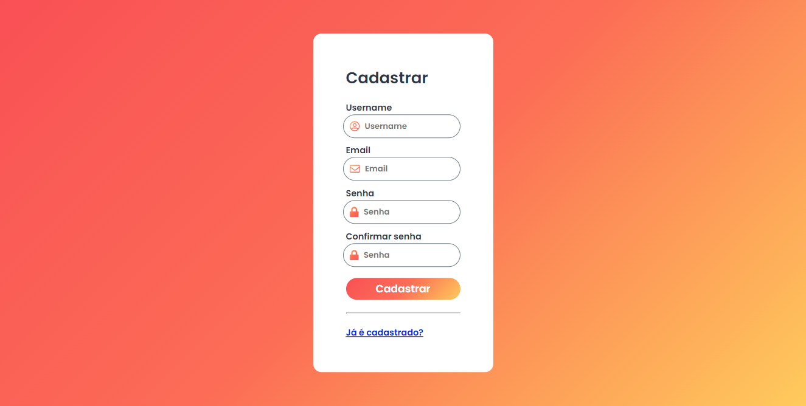
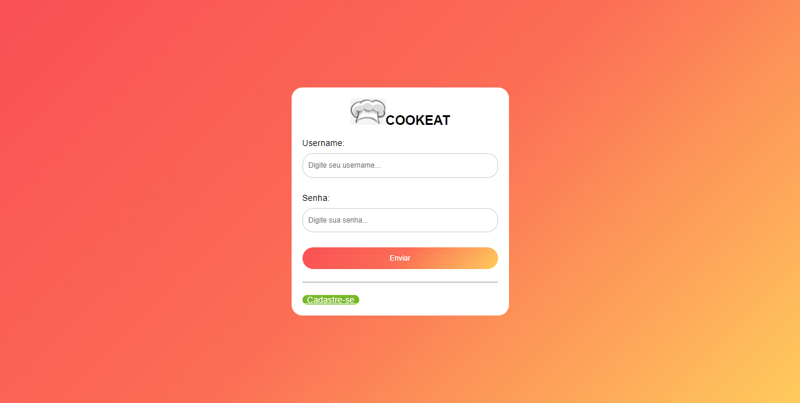
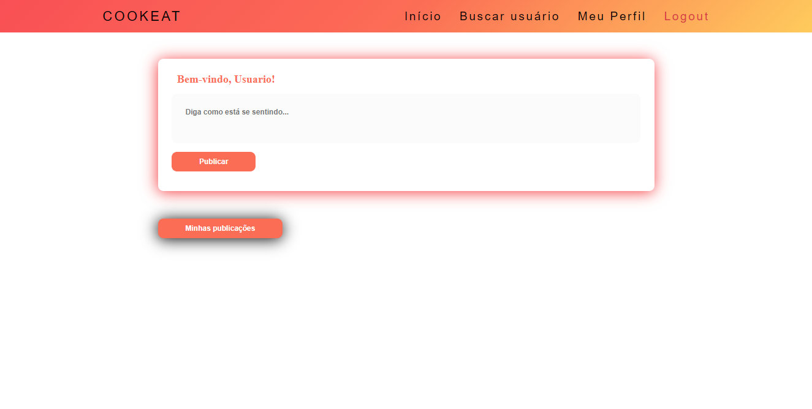

# Manual do Usuário

Bem-vindo ao Manual CookEat! Esse é um pequeno manual sobre as funcionalidades do site e como usá-las para que tenha a melhor experiência possivel em nosso site! As Funcionalidades estão divididas em tópicos e categorias para melhor entendimento. Lembre-se: Seja respeitoso, e então, desfrute da plataforma.

**Lista das Funcionalidades de usuário:**

 - [Início](#Início)
 - [Realizar Cadastro](#Realizar-Cadastro)
 - [Efetuar Login](#Efetuar-Login) 
 - [Efetuar Logout](#Efetuar-Logout)
 - [Fazer Postagem](#Fazer-Postagem)
 - [Alteração de Cadastro](#Alteração-de-Cadastro)
 - [Buscar usuários](#Buscar-Usuários)
 

**Lista das Funcionalidades exclusivas para administradores:**
 
 - [Exibir Usuários](#Exibir-Usuários)
 - [Editar Usuário ](#Editar-Usuário)
 - [Promover Usuário](#Promover-Usuário)
 - [Rebaixar Administrador](#Rebaixar-Administrador)
 - [Excluir Usuário](#Excluir-Usuário)

## Funcionalidades de Usuário

### Início 

o site abrirá a página para que você possa, caso esteja cadastrado, iniciar sessão ou, caso não, efetuar cadastro.

### Realizar Cadastro

Clique em "Cadastre-se" na página inicial. O site te redirecionará para a página de cadastro, onde você deverá preencher os campos Username, Email, Senha e Confirmar senha.
Após o preenchimento, o site retornará para a página inicial caso não haja erros. 

Se houver algum erro de cadastro, o site te redirecionará para a página de Feedback indicando o erro. Clique em "Voltar" para retornar à página de cadastro.

### Efetuar Login (Iniciar Sessão)

Na página primeira, preencha os campos Username e Senha. Após o preenchimento, o site te redirecionará para a página "Home" caso não haja erros.

Se houver algum erro de login, o site te redirecionará para a página de Feedback indicando o erro. Clique em "Voltar" para retornar à página de cadastro.

### Efetuar Logout (Encerrar Sessão)

### Fazer Postagem

### Alteração de Cadastro

### Buscar Usuários

## Funcionalidades exclusivas para Moderadores

### Exibir Usuários

### Editar Usuário

### Promover Usuário

### Rebaixar Administrador

### Excluir Usuário

