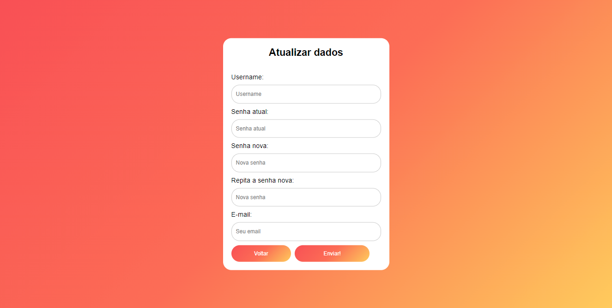

# Manual do Usuário

Bem-vindo ao Manual CookEat! Esse é um pequeno manual sobre as funcionalidades do site e como usá-las para que tenha a melhor experiência possivel em nosso site! As Funcionalidades estão divididas em tópicos e categorias para melhor entendimento. Lembre-se: Seja respeitoso, e então, desfrute da plataforma.

**Lista das Funcionalidades de usuário:**

 - [Início](#Início)
 - [Realizar Cadastro](#Realizar-Cadastro)
 - [Efetuar Login](#Efetuar-Login) 
 - [Efetuar Logout](#Efetuar-Logout)
 - [Fazer Postagem](#Fazer-Postagem)
 - [Alteração de Cadastro](#Alteração-de-Cadastro)
 - [Buscar usuários](#Buscar-Usuários)
 

**Lista das Funcionalidades exclusivas para administradores:**
 
 - [Exibir Usuários](#Exibir-Usuários)
 - [Editar Usuário ](#Editar-Usuário)
 - [Promover Usuário](#Promover-Usuário)
 - [Rebaixar Administrador](#Rebaixar-Administrador)
 - [Excluir Usuário](#Excluir-Usuário)

## Funcionalidades de Usuário

### Início 

o site abrirá a página para que você possa, caso esteja cadastrado, iniciar sessão ou, caso não, efetuar cadastro.

### Realizar Cadastro

Clique em "Cadastre-se" na página inicial. O site te redirecionará para a página de cadastro, onde você deverá preencher os campos Username, Email, Senha e Confirmar senha.
Após o preenchimento, o site retornará para a página inicial caso não haja erros. 

Caso haja erros de cadastro, o site te redirecionará para a página de Feedback indicando o erro. Clique em "Voltar" para retornar à página de cadastro.

### Efetuar Login (Iniciar Sessão)

Na página primeira, preencha os campos Username e Senha. Após o preenchimento, o site te redirecionará para a página "Home" caso não haja erros.

Caso haja erros de login, o site te redirecionará para a página de Feedback indicando o erro. Clique em "Voltar" para retornar à página de cadastro.

### Efetuar Logout (Encerrar Sessão)

Clique no botão "Logout", localizado na barra de navegação (Isso pode ser feito em qualquer página do site).

Ao clicar, o site abrirá uma caixa de diálogo pedindo a confirmação do Logout. Clique em "Ok" para confirmar ou "Cancelar" para impedir o encerramento da sessão. Caso escolha a opção "Ok", o site retornará para a página de login e, caso escolha a opção "Cancelar", o site permanecerá na página atual.

### Fazer Postagem

Clique no botão "Início", localizado na barra de navegação (Isso pode ser feito em qualquer página do site). O site te redirecionará para a página "Home".

Escreva o texto que deseja postar na seção "Bem Vindo, *seu nome de usuário*!". Após terminar de escrever, clique em "Publicar". O site te redirecionará para a página de Feedback, indicando que a postagem foi efetuada com sucesso. Clique em "Voltar" para retornar à página "Home".

Caso haja erros de postagem, o sistema os indicará na página de Feedback. Clique em "Voltar" para retornar à página "Home".

### Alteração de Cadastro

Clique no botão "Meu Perfil", localizado na barra de navegação (Isso pode ser feito em qualquer página do site). O site te redirecionará para a página "Meu Perfil".

Na página "Meu Perfil", clique no botão "alterar dados". O site te redirecionará para a página de alteração de cadastro, onde você preencherá os campos Username, Senha atual, Senha nova, Repita a senha nova e E-mail.

Após o preenchimento, o site abrirá uma caixa de diálogo pedindo a confirmação da alteração dos dados. Clique em "Ok" para continuar ou "Cancelar" para permanecer na página. Ao clicar em "Ok", caso os não haja erros de cadastro, o site te redirecionará para a página de Feedback, indicando que os dados foram alterados com sucesso. Clique em "Voltar" para retornar à página "Meu Perfil".
 

Caso haja erros de cadastro, o sistema os indicará na página de Feedback. Clique em "Voltar" para retornar à página "Meu Perfil".

 

### Buscar Usuários

Clique no botão "Buscar Usuário", localizado na barra de navegação (Isso pode ser feito em qualquer página do site). O site te redirecionará para a página "Busca de Usuários".

Na página "Busca de Usuários", clique no  ícone de  lupa, localizado no centro da página, e escreva o username (nome do usuário) que deseja buscar. Após isso, aperte a tecla "Enter". O sistema te redirecionará para a página "Exibir Usuário", onde o site listará o usuário com tal username.

Para exibir o perfil do usuário pesquisado, clique no botão "Ver Perfil", localizado no card que contém o username (nome de usuário) e email do usuário. O sistema te redirecionará para a página "perfil" referente ao usuário escolhido.

## Funcionalidades exclusivas para Moderadores

### Exibir Usuários

Clique no botão "Exibir Usuários", localizado na barra de navegação de moderador (Isso pode ser feito em qualquer página do site). O site te redirecionará para a página "Exibir Usuários".

Para exibir o perfil de um usuário exibido, clique no botão "gerenciar", localizado no card que contém as informações desse do usuário. O sistema te redirecionará para a página "perfil" referente ao usuário escolhido.

### Editar Usuário

No perfil do usuário desejado, clique no botão "alterar dados", localizado próximo aos botões "excluir usuário" e "promover"/"rebaixar". O site te redirecionará para a página "Edição de Usuário", onde você preencherá os campos Username, Senha nova, Repita a senha nova e E-mail.

Após o preenchimento, o site abrirá uma caixa de diálogo pedindo a confirmação da alteração dos dados. Clique em "Ok" para continuar ou "Cancelar" para permanecer na página. Ao clicar em "Ok", caso os não haja erros de cadastro, o site te redirecionará para a página de Feedback, indicando que os dados foram alterados com sucesso. Clique em "Voltar" para retornar à página "Home".

CCaso haja erros de cadastro, o sistema os indicará na página de Feedback. Clique em "Voltar" para retornar à página "Home".

### Promover Usuário

### Rebaixar Administrador

### Excluir Usuário

